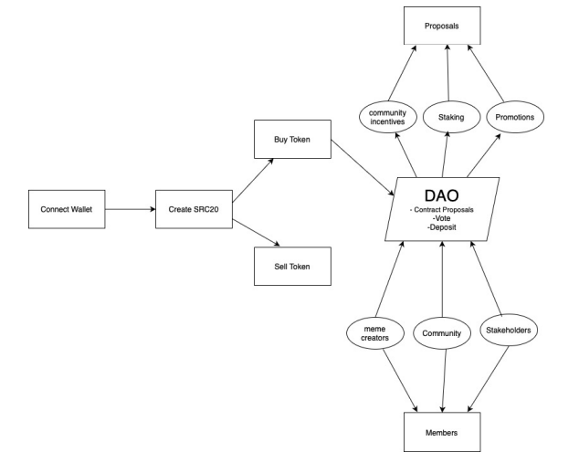

<p align="center">
  
</p>

# Memetro

**Memetro** is a decentralized platform designed for meme creators and enthusiasts to govern the lifecycle of meme tokens through a DAO (Decentralized Autonomous Organization). Built using the **SRC20** standard, Memetro allows users to buy, sell, and vote on meme tokens, with governance decisions being made once a token reaches a specified threshold. The DAO makes critical decisions regarding liquidity provision, token burning, staking, community engagement, and promotion/marketing.

## Table of Contents

- [Project Architecture](#project-architecture)
- [Project Overview](#project-overview)
- [Features](#features)
- [How It Works](#how-it-works)
  - [Token Lifecycle](#token-lifecycle)
  - [DAO Mechanics](#dao-mechanics)
  - [Voting Process](#voting-process)
- [Smart Contract Design](#smart-contract-design)
  - [SRC20 Contract](#src20-contract)
  - [DAO Contract](#dao-contract)
- [Threshold & DAO Initialization](#threshold--dao-initialization)
- [Governance](#governance)
- [Getting Started](#getting-started)
- [Roadmap](#roadmap)

---

## Project Architecture

<p align="center">
  
</p>

Memetro consists of two main components:

1. **SRC20 Contract**: This contract implements the token standards and handles core token functionalities like token minting, transfers, and managing balances.
2. **DAO Contract**: This contract handles the governance mechanisms, proposal creation, and voting processes for decisions about the token after the DAO is initialized.

Both contracts interact to form the complete lifecycle of a token from its creation to community-driven governance.

## Project Overview

Memetro provides a decentralized platform that uses meme tokens as its core unit of governance. Meme tokens are created through community proposals, and users can buy or sell these tokens before the DAO is initialized. When the total value of the token reaches a predetermined threshold, a DAO is created. All major decisions about the token, such as liquidity management, staking, and marketing, are made through DAO proposals.

This platform allows creators and enthusiasts to have direct control over the growth and utility of meme tokens, promoting greater community engagement and meme-driven governance.

---

## Features

- **SRC20 Standard**: Utilizes the SRC20 standard for seamless creation and management of meme tokens.
- **Decentralized Governance**: DAO-driven decision-making for token management.
- **Threshold-Based DAO Initialization**: DAO is initialized when token liquidity or value crosses a certain threshold.
- **Flexible Voting System**: Users can vote on proposals related to liquidity, marketing, token burning, and more.
- **Community Focus**: The DAO empowers meme creators and the community to influence the token's direction.
- **Buy/Sell Mechanism**: Users can buy and sell tokens until the threshold is reached, at which point the DAO takes over.

---

## How It Works

### Token Lifecycle

1. **Token Creation**: Users can create meme tokens, which will be available for purchase or sale.
2. **Pre-DAO Stage**: Users can then buy and sell the meme tokens before the token reaches a certain value or liquidity threshold.
3. **Threshold Achievement**: Once the total token value (or liquidity) reaches the threshold, the DAO is initialized.
4. **DAO Governance**: Post-threshold, the DAO governs all major decisions regarding the meme token.

### DAO Mechanics

Once the DAO is initialized, it takes full control over the meme token. The community can propose and vote on various aspects of the token, including:

- **Liquidity Provision**: Deciding the amount of liquidity to provide.
- **Token Burning**: Voting on whether to burn tokens to reduce supply.
- **Staking**: Decisions about staking mechanisms for rewards or governance.
- **Community Engagement**: Proposals for events, collaborations, and user engagement strategies.
- **Marketing & Promotion**: Community-driven decisions on promoting and marketing the meme token.

### Voting Process

The voting mechanism in Memetro is highly flexible. Proposals can be made by any user with a certain amount of meme coins. Voting takes place on each proposal, and if it passes the required acceptance percentage, it is executed automatically.

Key points:

- Users vote by locking their meme coins.
- Votes can be cast for or against a proposal.
- Votes are locked during the voting process and can be unlocked afterward.

---

## Smart Contract Design

### SRC20 Contract

The **SRC20 Contract** governs the core functionalities of the meme token itself, including token minting, transfers, and balances.

#### Key Features:

- **Minting**: Tokens are created by submitting a valid proposal.
- **Balance Tracking**: The contract tracks user balances for voting and buy/sell operations.

### DAO Contract

The **DAO Contract** manages the governance of meme tokens once the token reaches the threshold. It stores proposals, handles voting, and executes proposals if approved by the community. This contract also handles the buy and sell mechanisms that users interact with before the DAO is initialized.

#### Key Features:

- **Buy/Sell Functionality**: Users can buy or sell tokens up to the DAO initialization.
- **Proposal Creation**: Users can submit proposals to alter token governance.
- **Voting System**: Tracks user votes and enforces voting outcomes.
- **Proposal Execution**: If a proposal is accepted, the contract automatically executes the corresponding transactions.

---

## Threshold & DAO Initialization

The core mechanism of Memetro revolves around the threshold for DAO initialization. Before this point, users are free to buy and sell tokens as they see fit. However, when the total value (or liquidity) of the token reaches a pre-set threshold, the DAO becomes active. From this point, all decisions about the token are governed by community proposals and voting.

The threshold system is designed to ensure that only popular and well-supported meme tokens enter DAO governance, thus protecting users from low-liquidity or low-value tokens.

---

## Governance

Governance in Memetro is decentralized and user-driven. The community can vote on proposals ranging from token economics (burning, staking) to marketing strategies. Memetro allows meme creators and enthusiasts to have direct control over the future of their tokens.

Key governance features include:

- **Community-Driven Proposals**: Any user holding meme tokens can create proposals.
- **Acceptance Percentage**: Proposals must meet a predefined acceptance percentage to pass.
- **DAO Voting**: Users vote on proposals using their meme tokens.
- **Threshold-Based Activation**: Governance is only activated after the threshold is met.

---

## Getting Started

### Prerequisites

- **Rust & Sway Toolchains**: Ensure that you have both toolchains installed for compiling the smart contracts.
- **Fuel Network Wallet**: You'll need a wallet that supports the Fuel network to interact with Memetro.

### Installation

1. Clone the repository:

   ```bash
   git clone https://github.com/alade-dev/memetro.git
   ```

2. Install dependencies and compile the contracts:

   ```bash
   forc build
   ```

3. Deploy the both contracts:

   ```bash
   forc deploy --testnet
   ```

### Usage

1. **Token Creation**: A user creates a new meme token using the SRC20 contract.
2. **Buying/Selling**: The community can buy and sell the meme token.
3. **Threshold Reached**: Once the token reaches the preset liquidity threshold, the DAO is initialized.
4. **DAO Governance**: The community starts governing the token. Proposals regarding liquidity, token burning, staking, and promotion are created and voted on.
5. **Proposal Execution**: Approved proposals are executed, and the token’s future is shaped by its holders.

---
